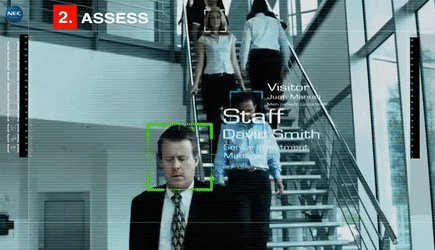

# Real time face recognition Using Facenet 🧔 🤖 🔍


[](https://naemazam.github.io/Researcher/)

## Description 📰 
A facial recognition system is a technology capable of identifying or verifying a person from a digital image or a video frame from a video source. There are multiples methods in which facial recognition systems work, but in general, they work by comparing selected facial features from given image with faces within a database.


## Functionalities added 🕵️‍♂️
1. Using face align functionality from dlib to predict effectively while live streaming.


## Python  Implementation 👨‍🔬

1) Network Used- Inception Network
2) Original Paper - Facenet by Google
3) Constant Face Location and Acknowledgment - Naem Azam 

If you face any problem, kindly raise an issue


## File Organization 🗄️

```shell
├── Real-time-face-recognition-Using-Facenet (Current Directory)
    ├── encodings
    ├── architecture.py
    ├── detect.py
    ├── facenet_keras_weights.h5
    ├── train_v2.py
    ├── requirements.txt
    ├── Faces
        ├── Azam
        └── winnie
        └── JackieChan
    └── readme.md
```

# Dependencies 💾
This code was working properly on tensroflow 2.3.0.
- Tensorflow 2.X
- numpy
- opencv-python
- mtcnn
- scikit-learn
- scipy

## Code Requirements 🦄
You can install Conda for python which resolves all the dependencies for machine learning.

`pip install requirements.txt`


## Menual dependencies install with pip 👨‍🔬

Install python 3.x and Conda 

### [ Installing virtualenv](http://timsherratt.org/digital-heritage-handbook/docs/python-pip-virtualenv/) 

`pip install virtualenv`


### [Install TensorFlow in windows ](https://www.tensorflow.org/install/pip#windows) 

` conda install -c conda-forge cudatoolkit=11.2 cudnn=8.1.0 `

`python3 -m pip install tensorflow`
   
   Verify install:

`python3 -c "import tensorflow as tf; print(tf.config.list_physical_devices('GPU'))"`

### [Install TensorFlow in Linux ](https://www.tensorflow.org/install/pip#windows) 

` conda install -c conda-forge cudatoolkit=11.2 cudnn=8.1.0 `

`export LD_LIBRARY_PATH=$LD_LIBRARY_PATH:$CONDA_PREFIX/lib/`

`python3 -m pip install tensorflow`

 Verify install:

`python3 -c "import tensorflow as tf; print(tf.config.list_physical_devices('GPU'))"`


### [install opencv-python 4.5.5.64](https://pypi.org/project/opencv-python/) 

` pip install opencv-python `

### [install scikit-learn]() 

` python -m venv sklearn-venv `

`sklearn-venv\Scripts\activate `

`pip install -U scikit-learn `

### [install mtcnn 0.1.1](https://pypi.org/project/mtcnn/) 

` pip install mtcnn `

### [scipy](https://scipy.org/install/) 

` python -m pip install --user numpy scipy matplotlib ipython jupyter pandas sympy nose `


## SetUp 🖥️ 
0. Download [facenet_keras_weights.h5](https://github.com/D2KLab/FaceRec/blob/master/model/facenet_keras_weights.h5) and put it accoding to our file Organization
1. Make a directory of your name inside the **Faces** folder and upload your 2-3 pictures of you.

2. Train Your System

```Python
python train_v2.py
```

## Real time face recognition 🧔 🤖 🔍

Run this for real time Face recognition, it will open your camera and start detection 

```Python
python detect.py
```

## Results 📊



## Thesis 📰 

Constant Face Location and Acknowledgment
By Naem Azam 
DOI:10.13140/RG.2.2.35497.2672

## References 🔱
 
 - Florian Schroff, Dmitry Kalenichenko, James Philbin (2015). [FaceNet: A Unified Embedding for Face Recognition and Clustering](https://arxiv.org/pdf/1503.03832.pdf)
 - Yaniv Taigman, Ming Yang, Marc'Aurelio Ranzato, Lior Wolf (2014). [DeepFace: Closing the gap to human-level performance in face verification](https://research.fb.com/wp-content/uploads/2016/11/deepface-closing-the-gap-to-human-level-performance-in-face-verification.pdf) 
 - The pretrained model we use is inspired by Victor Sy Wang's implementation and was loaded using his code: https://github.com/iwantooxxoox/Keras-OpenFace.
 - Our implementation also took a lot of inspiration from the official FaceNet github repository: https://github.com/davidsandberg/facenet  
